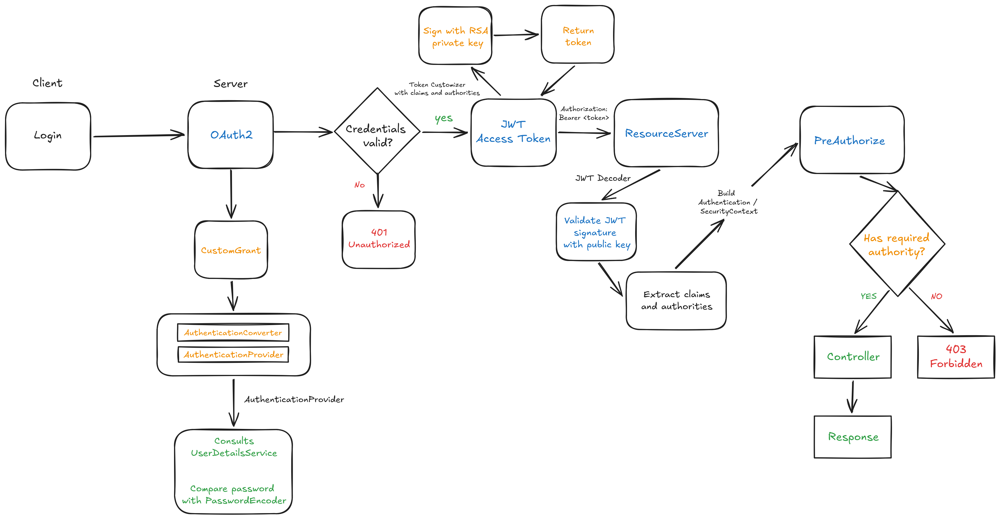

# 🎫 Helpdesk API

A production-oriented REST API for managing support tickets, users, categories, and roles. Built with Java 21, Spring Boot 3.4.5, OAuth2/JWT authentication, and real-time WhatsApp/SMS notifications via Twilio.


---

## 🌐 Live Demo

The API is deployed on AWS EC2 and publicly accessible.

| Resource | URL |
|---|---|
| Swagger UI | http://helpdesk-marco.duckdns.org:8080/swagger-ui/index.html |
| API Docs (JSON) | http://helpdesk-marco.duckdns.org:8080/api-docs |
| Base URL | http://helpdesk-marco.duckdns.org:8080 |

---

## 🧭 Why I Built This

My background combines software engineering studies with hands-on experience in network troubleshooting, NOC environments, and administrative workflows. I wanted to simulate a realistic helpdesk environment, the kind used by network operations and support teams, as a way to bridge those two worlds in code.

The system goes beyond basic CRUD. I wanted clients to be immediately notified whenever their ticket status changed, so they would not be left wondering about the progress of their own support request. That same principle guided the decision to send a welcome notification when a new user is created, without exposing the password, for obvious security reasons.

Role-based access was designed from real operational assumptions: a client should not be able to change their own ticket status, a NOC operator should not be able to delete users, and only an admin should have full control. OAuth2 + Spring Security enforces those boundaries at the method level, with BCrypt protecting passwords at rest.

---

## 🚀 Tech Stack

| Layer | Technology |
|---|---|
| Language | Java 21 |
| Framework | Spring Boot 3.4.5 |
| Security | Spring Security · OAuth2 Authorization Server · JWT (Resource Server) |
| Persistence | Spring Data JPA / Hibernate |
| Database | PostgreSQL (dev/prod) · H2 (test) |
| Validation | Bean Validation (Jakarta) |
| Notifications | Twilio (WhatsApp / SMS) |
| Documentation | SpringDoc OpenAPI / Swagger UI |
| Infrastructure | Docker Compose (PostgreSQL 14-alpine + pgAdmin) |
| Testing | JUnit 5 · Mockito · WebMvcTest · DataJpaTest · SpringBootTest |
| Coverage | JaCoCo |

---

## 🏛️ Architecture

The project follows a **layered architecture** with clear separation of concerns:

```
HTTP Request
    └── Controller         (route mapping, Bean Validation, declarative auth)
         └── Service       (business rules, imperative auth, Twilio integration)
              └── Repository (JPA queries, JPQL projections, JOIN FETCH)
                   └── Entity (User, Role, Ticket, Category)

Exceptions → ControllerAdvice → standardized HTTP error payloads
```

### Package Structure

```text
controller/
  handlers/
services/
repositories/
entities/
  enums/
dtos/
  user/
  ticket/
  category/
  role/
  message/
config/
  customgrant/
projections/
exceptions/
```

---

## 🔐 Authentication & Authorization

**Mechanism:** OAuth2 Authorization Server with a custom `password` grant type. Tokens are signed JWTs validated by the Resource Server on every request. Roles and username are embedded as claims at issuance.

**Token lifetime:** 86400 seconds (24h). Configurable via `JWT_DURATION`.

> ⚠️ Keys are generated in memory at startup. Tokens are invalidated after a server restart. Persistent key storage is on the roadmap.

### Auth Flow



### Getting a Token

```bash
curl -X POST http://18.228.31.222:8080/oauth2/token \
  -u "myclientid:myclientsecret" \
  -d "grant_type=password&username=admin@helpdesk.com&password=YourPassword&scope=read write"
```

Or locally:

```bash
curl -X POST http://localhost:8080/oauth2/token \
  -u "myclientid:myclientsecret" \
  -d "grant_type=password&username=admin@helpdesk.com&password=YourPassword&scope=read write"
```

Response:
```json
{
  "access_token": "<jwt>",
  "token_type": "Bearer",
  "expires_in": 86400
}
```

Use the token in all subsequent requests:
```
Authorization: Bearer <access_token>
```

### Roles

| Role | Permissions |
|---|---|
| `ROLE_ADMIN` | Full access: users, tickets, categories, roles |
| `ROLE_NOC` | Read/update tickets · Create/edit/delete categories · `/users/me` · Send messages |
| `ROLE_SUPPORT` | Read/update tickets · Search by title/category · `/users/me` · Send messages |
| `ROLE_CLIENT` | Create tickets · View own tickets (`selfOrAllowed`) · `/users/me` |

**Authorization strategy:** Two-level enforcement:
- **`selfOrAdmin`** — a user can only access their own data unless they hold `ROLE_ADMIN`
- **`selfOrAllowed`** — a client can only view their own ticket; NOC/ADMIN/SUPPORT can view all

### Password Rules

Passwords must:
- Have between 4 and 15 characters
- Contain at least one uppercase letter
- Contain at least one lowercase letter
- Contain at least one number
- Contain at least one symbol

All passwords are hashed with **BCrypt** before storage.

---

## 📋 Business Rules

| Rule | Enforced In | Critical |
|---|---|---|
| User can only access own data unless admin (`selfOrAdmin`) | `AuthService` + `UserService.findById` | ✅ |
| Client can only see own ticket; team roles see all (`selfOrAllowed`) | `AuthService` + `TicketService` | ✅ |
| New ticket is automatically associated to the authenticated user | `TicketService.copyDTOtoEntity` | ✅ |
| New ticket always starts with `priority=LOW`, `status=OPEN` | `TicketService.copyDTOtoEntity` | — |
| Email must be unique per user | `UserService.insert` + DB unique constraint | ✅ |
| All role IDs sent on user creation must exist | `UserService.insert` | ✅ |
| All category IDs sent on ticket creation must exist | `TicketService.insert` | ✅ |
| Ticket can only be deleted when `status=CLOSED` | `TicketService.delete` | ✅ |
| PATCH status only executes if new value differs from current | `TicketService.patchStatus` | ⚠️ |
| PATCH priority only executes if new value differs from current | `TicketService.patchPriority` | ⚠️ |
| Category name must be unique | `CategoryService.insert` | ⚠️ |
| Search by title/category rejects blank parameter | `TicketService.findByTitle/findByCategory` | ⚠️ |
| Twilio failure is encapsulated as `MessageException` → HTTP 503 | `UserService` + `TicketService` wrappers | — |

---

## 🔌 Endpoints

Base URL: `http://18.228.31.222:8080`

All endpoints require `Authorization: Bearer <token>` unless stated otherwise.

---

### Auth

#### Issue access token

```http
POST /oauth2/token
```

Form parameters (with client credentials via Basic Auth):

```text
grant_type=password
username=admin@helpdesk.com
password=YourPassword
scope=read write
```

---

### Users

#### Get authenticated user

```http
GET /users/me
```

#### Get user by ID

```http
GET /users/{id}
```

#### List users (paginated)

```http
GET /users?page=0&size=10
```

#### List users with roles

```http
GET /users/searchroles
```

#### Search users by name

```http
GET /users/search?name=marco
```

#### Create user

```http
POST /users
```

```json
{
  "name": "marco123",
  "email": "marco@email.com",
  "ddd": 11,
  "phone": "998877665",
  "password": "Abc@1234",
  "roles": [{ "id": 4 }]
}
```

#### Update user

```http
PUT /users/{id}
```

```json
{
  "name": "marco123",
  "email": "marco@email.com",
  "ddd": 11,
  "phone": "998877665",
  "password": "Abc@1234",
  "roles": [{ "id": 4 }]
}
```

#### Delete user

```http
DELETE /users/{id}
```

---

### Tickets

#### Get ticket by ID

```http
GET /tickets/{id}
```

#### Get ticket (selfOrAllowed rule)

```http
GET /tickets/me/{id}
```

#### List tickets (paginated)

```http
GET /tickets?page=0&size=10
```

#### List tickets with user data

```http
GET /tickets/searchusers?page=0&size=10
```

#### Search tickets by title

```http
GET /tickets/searchtitle?title=internet
```

#### Search tickets by category

```http
GET /tickets/searchcategory?category=Connectivity
```

#### List tickets by oldest first

```http
GET /tickets/byoldest?page=0&size=10
```

#### Create ticket

```http
POST /tickets
```

```json
{
  "title": "Internet down",
  "description": "Customer reports no connectivity since morning",
  "categories": [{ "id": 3 }]
}
```

#### Update ticket (status + priority)

```http
PUT /tickets/{id}
```

```json
{
  "status": "IN_PROGRESS",
  "priority": "HIGH"
}
```

#### Patch ticket status

```http
PATCH /tickets/{id}/status
```

```json
{
  "status": "RESOLVED"
}
```

Available statuses: `OPEN` · `IN_PROGRESS` · `RESOLVED` · `CLOSED`

#### Patch ticket priority

```http
PATCH /tickets/{id}/priority
```

```json
{
  "priority": "HIGH"
}
```

Available priorities: `LOW` · `MEDIUM` · `HIGH`

#### Delete ticket

```http
DELETE /tickets/{id}
```

> Only tickets with `status=CLOSED` can be deleted.

---

### Categories

#### Get category by ID

```http
GET /categories/{id}
```

#### List all categories

```http
GET /categories
```

#### List categories with tickets

```http
GET /categories/searchtickets
```

#### Create category

```http
POST /categories
```

```json
{
  "name": "Connectivity",
  "description": "Issues related to internet, link and signal"
}
```

#### Update category

```http
PUT /categories/{id}
```

#### Delete category

```http
DELETE /categories/{id}
```

---

### Roles

#### List all roles

```http
GET /roles
```

#### Get role by ID

```http
GET /roles/{id}
```

#### List roles with users

```http
GET /roles/searchusers
```

---

### Messages

#### Send custom message

```http
POST /send-message
```

```json
{
  "sender": "helpdesk",
  "ddd": 11,
  "phoneNumber": "998877665",
  "message": "Your ticket has been updated."
}
```

---

## ⚠️ Error Handling

All errors are handled centrally via `@ControllerAdvice` with a standardized payload.

| Code | Meaning |
|---|---|
| `400 Bad Request` | Validation errors, malformed requests, business rule violations (e.g. deleting an open ticket) |
| `401 Unauthorized` | Missing or invalid JWT token |
| `403 Forbidden` | Authenticated but not authorized to perform the action |
| `404 Not Found` | Resource not found |
| `503 Service Unavailable` | Twilio notification failure |

---

## ⚙️ Environment Variables

### Required

| Variable | Description | Example |
|---|---|---|
| `APP_PROFILE` | Spring active profile | `test` \| `dev` \| `prod` |
| `CLIENT_ID` | OAuth2 client ID | `myclientid` |
| `CLIENT_SECRET` | OAuth2 client secret | `myclientsecret` |
| `JWT_DURATION` | Token lifetime in seconds | `86400` |
| `CORS_ORIGINS` | Allowed origins (comma-separated) | `http://localhost:5173` |
| `DB_URL` | PostgreSQL JDBC URL | `jdbc:postgresql://localhost:5433/helpdeskapi` |
| `DB_USERNAME` | Database user | `postgres` |
| `DB_PASSWORD` | Database password | `yourpassword` |
| `TWILIO_ACCOUNT_SID` | Twilio account SID | `ACxxxxxxxxxxxxxxxxxxxxxxxx` |
| `TWILIO_AUTH_TOKEN` | Twilio auth token | `xxxxxxxxxxxxxxxxxxxxxxxx` |
| `TWILIO_WHATSAPP_FROM` | Twilio sender number | `whatsapp:+14155238886` |

### Optional (Docker Compose only)

| Variable | Default |
|---|---|
| `POSTGRES_DB` | `mydatabase` |
| `POSTGRES_USER` | `postgres` |
| `POSTGRES_PASSWORD` | `1234567` |
| `PGADMIN_DEFAULT_EMAIL` | `me@example.com` |
| `PGADMIN_DEFAULT_PASSWORD` | `1234567` |

> ⚠️ Twilio variables are required for notification features.

---

## 🛠️ Running Locally

### Prerequisites

| Tool | Minimum Version |
|---|---|
| Java | 21 |
| Maven | 3.9.x |
| Docker + Docker Compose | any recent version |

### Option 1 — H2 in-memory (no external DB needed)

```bash
git clone https://github.com/tonicostmarco/helpdesk-spring-api
cd helpdesk-spring-api
APP_PROFILE=test ./mvnw spring-boot:run
```

The `test` profile loads `import.sql` automatically with seed data.

### Option 2 — PostgreSQL via Docker

```bash
# Start PostgreSQL (port 5433) + pgAdmin
docker compose up -d

# Set environment variables, then run
APP_PROFILE=dev ./mvnw spring-boot:run
```

### Swagger UI

```
http://localhost:8080/swagger-ui/index.html
```

Use the `/oauth2/token` endpoint to obtain a token, then click **Authorize** in Swagger UI.

---

## 🌱 Seed Data

The following users are available when running with `APP_PROFILE=test`:

| Name | Email | Role |
|---|---|---|
| Marco Admin | `admin@helpdesk.com` | `ROLE_ADMIN` |
| NOC User | `noc@helpdesk.com` | `ROLE_NOC` |
| Support User | `support@helpdesk.com` | `ROLE_SUPPORT` |
| Ana Client | `client@helpdesk.com` | `ROLE_CLIENT` |

Credentials are defined in `src/main/resources/import.sql`.

For PostgreSQL (dev/prod), run `create.sql` to apply schema and initial data.

---

## 🧪 Tests

```bash
./mvnw test
```

| Type | Slice | What it covers |
|---|---|---|
| Controller | `@WebMvcTest` | HTTP layer, security, Bean Validation, request/response contracts |
| Service (unit) | Mockito + `@ExtendWith(MockitoExtension)` | Business rules, ownership authorization, exception handling in isolation |
| Service (integration) | `@SpringBootTest` + H2 | Real persistence, Spring Security context, transactional behavior, ownership enforcement end-to-end |
| Repository | `@DataJpaTest` + H2 | Query correctness, ordering, projections |
| Context | `@SpringBootTest` | Application context loads without errors |

**Notable test cases:**

| Test | Type | Validates |
|---|---|---|
| `TicketServiceTest.shouldThrowBusinessExceptionWhenStatusIsNotClosed` | Unit | Open ticket cannot be deleted |
| `TicketServiceTest.shouldThrowResourceNotFoundExceptionInInsertMethodWhenWrongCategories` | Unit | Invalid category IDs rejected on ticket creation |
| `TicketServiceTest.shouldThrowBusinessExceptionInPatchStatusWhenInvalidStatus` | Unit | PATCH status rejects same-value transitions |
| `TicketServiceIT.shouldThrowForbiddenExceptionWhenFindMeFromDifferentClient` | Integration | Ownership enforcement. Client cannot access another user's ticket |
| `TicketServiceIT.shouldReturnOldestTicketFirst` | Integration | Real DB ordering by `createdAt` ascending, verified with two persisted tickets |
| `TicketServiceIT.shouldInsertNewTicketWhenCorrectData` | Integration | Ticket persisted with correct owner, status, and default priority |
| `TicketServiceIT.shouldDeleteTicketWhenIdExistsAndTicketIsClosed` | Integration | Delete confirmed via `existsById` against real DB |
| `UserServiceTest.shouldThrowBusinessExceptionWhenEmailAlreadyRegisteredOnInsert` | Unit | Email uniqueness enforced on user creation |
| `UserServiceIT.shouldThrowForbiddenExceptionWhenUserAccessesAnotherUsersData` | Integration | `selfOrAdmin` rule enforced end-to-end with real Security context |
| `UserControllerTest.shouldReturnBadRequestWhenInsertUserWithInvalidInput` | Controller | Bean Validation on `POST /users` |
| `TicketControllerTest.shouldReturnUnauthorizedWhenFindAllWithoutAuth` | Controller | Protected routes require valid JWT |
| `TicketRepositoryTest.shouldReturnAllOrderedByOldestFirst` | Repository | Ticket ordering by creation date ascending |

---

## 🎯 Technical Decisions

| Decision | Reason |
|---|---|
| Custom `password` grant on Authorization Server | Practice building a complete OAuth2 flow with custom claims (`authorities`, `username`) embedded in the JWT, beyond standard form login |
| `@PreAuthorize` + imperative `selfOrAdmin`/`selfOrAllowed` checks | Enforce both role-based and ownership-based rules that depend on runtime data, not just token claims |
| Separate DTOs (Input / Min / Full) per resource | Decouple entity from API contract, control exactly what each response exposes, and prevent over-posting |
| JPQL with `JOIN FETCH` and DTO projections | Prevent N+1 queries on `users↔roles` and `tickets↔categories` relationships |
| `ControllerAdvice` with standardized error payload | Consistent error structure across all endpoints, simplifying both clients and test assertions |
| Twilio decoupled behind `MessageSender` interface | Enables `@MockitoBean` substitution in integration tests and allows swapping implementation with minimal impact |
| Unit + integration test layers for services | Unit tests validate business logic in isolation with fast feedback; integration tests verify real persistence, Security context, and transactional behavior against H2 |
| Multi-profile setup (test=H2, dev/prod=PostgreSQL) | Fast local test cycle without external dependencies; realistic production path |
| Docker Compose only for infrastructure | Keep app running directly on JVM for easier debugging and faster Spring Boot dev loop |

---

## ⚠️ Known Limitations

- JWT keys are generated in memory at startup, tokens are invalidated after a server restart.
- `Role` management (POST/PUT/DELETE) is scaffolded but currently commented out in `RoleController`.

---

## 🗺️ Roadmap

- [ ] Persistent JWT key storage (restart-safe tokens)
- [ ] Full CRUD for roles (already scaffolded in `RoleController`)
- [ ] Refresh token support
- [ ] Ticket assignment to support agents
- [ ] Ticket history and comment threads
- [x] Deploy to AWS EC2

---

## 📄 License

This project is licensed under the [MIT License](LICENSE).
